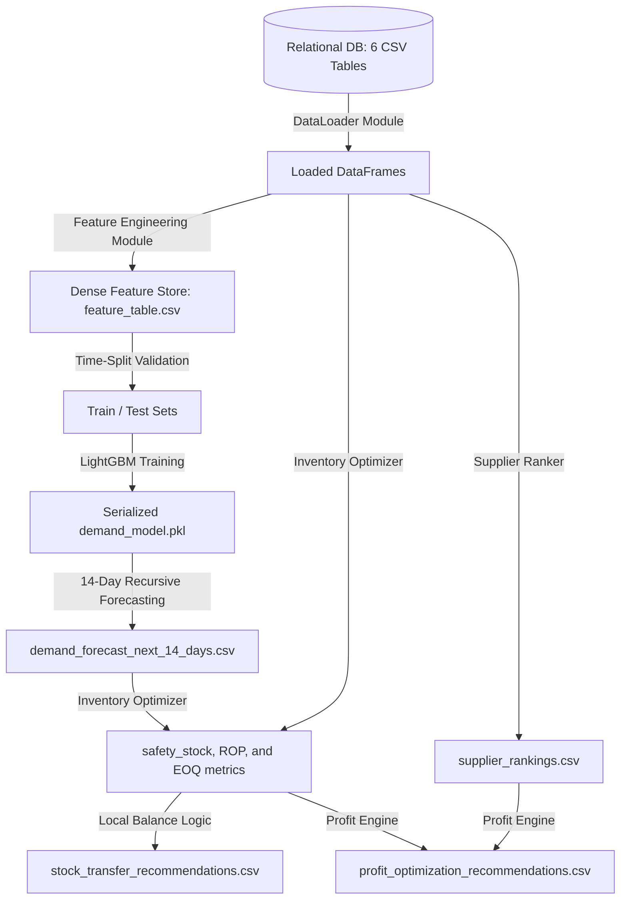

# RetailBrain AI: An Integrated Global LightGBM and Prescriptive Sourcing Pipeline for Quick-Commerce Profit Optimization

**B.Tech Final Year Capstone Project Submission**  
*   **Course:** B.Tech (Data Science & Predictive Analytics)
*   **Project Group:** Group 1
*   **Team Members:**
    1.  **Sneha** (Group Leader / Lead Data Scientist)
    2.  **Hritvik** (Analytics Engineer)
    3.  **Bhavya** (Data Engineer & Operations Analyst)
*   **Target Enterprise Model:** Blinkit India Quick-Commerce Network

---

## Abstract
Quick-commerce platforms operate in high-density urban areas, offering ultra-fast grocery delivery (10–15 minutes) from localized mini-fulfillment centers known as dark stores. Managing inventory in this environment is challenging due to physical storage capacity limits, highly volatile daily demand spikes, short perishable shelf lives, and multi-criteria supplier logistics. Traditional supply chain forecasting models fail because they cannot capture localized event-driven demand or manage JIT (Just-In-Time) sourcing loops. 

This paper introduces **RetailBrain AI**, an integrated predictive and prescriptive decision support system modeled after the operations of **Blinkit India**. The system uses a single global **LightGBM regressor** trained across 3,500 localized time-series to perform daily SKU-level demand forecasting. The predictive outputs feed into a prescriptive inventory optimizer that computes safety stock buffers, Economic Order Quantities (EOQ), and local inter-store **Stock Transfers** to rebalance surplus inventory. A multi-criteria scoring algorithm ranks suppliers by price, lead time, and performance rating. Validated on a 2.5-million-row transaction ledger, the forecasting model achieved an overall WAPE of **9.86%**, proving its capability to guide inventory management.

## Index Terms
Quick-commerce logistics, Demand Forecasting, LightGBM, Economic Order Quantity, Supplier Selection, Sourcing Optimization, Decision Support Systems.

---

## I. INTRODUCTION
Quick commerce has transformed the retail landscape in India's metros, driven by platforms like Blinkit, Zepto, and Instamart. Unlike traditional e-commerce, which relies on centralized distribution centers and 1–2 day delivery windows, quick commerce guarantees delivery within minutes. This speed is made possible by a network of localized dark stores, which are closed-door micro-warehouses located directly in residential and commercial areas.

However, dark stores face physical space constraints (typically 1,500 to 2,500 sq. ft.) and must hold only a few days of stock for a lean catalog of items. Managing this requires a highly responsive inventory management system. Standard statistical forecasting models (e.g., ARIMA or Holt-Winters) are computationally expensive when scaled to thousands of individual store-product combinations and struggle to model intermittent zero-demand days. 

This project addresses these challenges by building **RetailBrain AI**. The system compiles a dense feature store, trains a global gradient boosting model that shares learning across all store-product lines, and applies prescriptive optimization rules to generate actionable, profit-ranked procurement schedules.

---

## II. PROBLEM STATEMENT
Quick-commerce inventory managers face a double-bind:
1.  **Understocking Cost**: Running out of popular items (like fresh milk or bread) leads to immediate lost sales and customer churn, as quick-commerce consumers will immediately switch to competing apps if an item is out of stock.
2.  **Overstocking Cost**: Storing too much stock leads to physical space overflow in small dark stores and high waste write-offs, especially for perishables with a shelf life of under 5 days.

The operational goal is to dynamically compute a **Safety Stock Reorder Point (ROP)** and **Economic Order Quantity (EOQ)** for every store-product combination. Additionally, the system must optimize supplier selection. When an item reaches its ROP, the system must choose between 3 competing suppliers offering different trade-offs: low price with slow delivery, or high price with express delivery.

---

## III. SYSTEM ARCHITECTURE
The RetailBrain AI system uses a modular pipeline that separates data loading, feature store compilation, predictive modeling, and prescriptive optimization:

---

## IV. DATASET DESCRIPTION
The system is built on a 6-table relational database schema:

### A. Sales Dataset (`data/corrected_sales_dataset.csv`)
The transaction ledger contains **2,485,400 rows** spanning Jan 1, 2024, to Dec 31, 2025. It records date, store, product, quantity sold, unit price, discounts, net revenue, net profit, and environmental markers (Festival, Season).

### B. Products Dataset (`data/products.csv`)
The product dimension table cataloging **35 core items** across categories like Dairy, Groceries, and Snacks. It includes Maximum Retail Price (MRP), Selling Price, Cost Price, unit size, and Shelf Life in days.

### C. Stores Dataset (`data/stores.csv`)
The store master profiling the **100 dark stores**. It logs city, locality, capacity limits, and GPS coordinates (Latitude/Longitude) enriched with OpenStreetMap landmark counts.

### D. Inventory Dataset (`data/inventory.csv`)
The active status table holding **3,500 records** (100 stores $\times$ 35 products) of current stock, reserved stock in active carts, and target safety stock buffers.

### E. Suppliers Dataset (`data/suppliers.csv`)
The sourcing index containing **105 distributor offers** (3 suppliers per product). It defines supplier wholesale prices, shipping lead times, and ratings.

### F. Procurement Dataset (`data/procurement.csv`)
The sourcing ledger recording **609,756 historical Purchase Orders (POs)**, tracking order placement dates, costs, quantities, and supplier delivery dates.

---

## V. PROPOSED METHODOLOGY

### A. Data Loading and Preprocessing
The `DataLoader` module reads the 6 relational CSV tables and validates key structures. It standardizes variable names, handles missing festival values as `"None"`, and casts transaction timestamps to datetime objects.

### B. Feature Engineering
We transform the sparse transaction log into a dense grid of shape:
$$\text{Grid Size} = \text{Unique Dates (731)} \times \text{Stores (100)} \times \text{Products (35)} = 2,558,500 \text{ rows}$$
This captures explicit zero-demand days. Features are engineered per store-product-date:
1.  **Lags**: Demand values shifted by 1, 7, 14, and 28 days.
2.  **Rolling Statistics**: Rolling mean and standard deviation of demand over 7, 14, and 30-day windows.
3.  **Calendar**: Day of week, day of month, month, weekend indicators, and festival flags.
4.  **Categorical Codes**: Target encodings for store, product, category, and city.

### C. Demand Forecasting using LightGBM
We train a single global **LightGBM Regressor** using a Poisson objective function:
$$\mathcal{L} = \sum_{i} (\hat{y}_i - y_i \log \hat{y}_i)$$
Poisson regression is chosen because daily grocery demand consists of non-negative, right-skewed count values. Early stopping is applied using validation MAE.

### D. Inventory Optimization
1.  **Safety Stock**: Computed using demand variance during the backtest holdout period:
    $$\text{Safety\_Stock} = Z \times \sigma_{\text{daily}} \times \sqrt{\text{Lead\_Time}}$$
    *(Where $Z=1.65$ for 95% service level, and $\text{Lead\_Time}$ is the supplier delivery days).*
2.  **Reorder Point (ROP)**: Triggered when active inventory falls below:
    $$\text{ROP} = (\text{Mean Forecasted Daily Demand} \times \text{Lead\_Time}) + \text{Safety\_Stock}$$
3.  **Stock Transfers**: To minimize holding costs, if Store A has surplus stock ($Stock > 1.5 \times \text{Forecasted 30-day demand}$) and Store B in the same city is below its ROP, the engine recommends a local transfer of $\min(\text{surplus}, \text{shortage})$.

### E. Supplier Optimization
Suppliers are scored using a normalized multi-criteria utility score:
$$\text{Score} = w_{\text{price}} \cdot \bar{P} + w_{\text{lead\_time}} \cdot \bar{L} + w_{\text{rating}} \cdot \bar{R}$$
Where weights are set to Price = 50%, Lead Time = 20%, and Supplier Rating = 30%.

### F. Profit Optimization
For every product below its ROP, the engine evaluates the expected profit uplift of generating a PO to the highest ranked supplier:
$$\text{Expected\_Profit} = (\text{Forecasted\_Qty} \times \text{Selling\_Price}) - (\text{Order\_Qty} \times \text{Best\_Supplier\_Price}) - \text{Estimated\_Holding\_Cost}$$
These recommendations are sorted in descending order of expected profit.

---

## VI. MODEL IMPLEMENTATION

### A. Training Strategy
We implement a **walk-forward time-series split** for model validation:
*   **Training Set**: Transactions before Nov 1, 2025 ($2,348,500$ rows).
*   **Validation Set**: Transactions from Nov 1 to Dec 31, 2025 ($210,000$ rows).
This prevents data leakage from future dates.

### B. Feature Selection
The model ingests 27 features. Categorical variables (Store ID, Product ID, Category, City, Season, Festival) are handled natively by LightGBM's integer-based category split algorithm, which avoids the dimensionality expansion of one-hot encoding.

### C. Forecast Generation
For the future horizon (14 days ahead), the model uses a **recursive multi-step forecasting loop**. It predicts demand for day $t+1$, appends the prediction to the history, recomputes rolling means and standard deviations, and uses these updated features to predict day $t+2$.

### D. Optimization Pipeline
The optimization pipeline is scheduled as a batch job. It reads the model's future forecasts, joins them with current inventory levels and supplier offers, runs the safety stock and supplier scoring scripts, and writes the output tables (`profit_optimization_recommendations.csv`, `stock_transfer_recommendations.csv`) to the `outputs/` folder.

---

## VII. RESULTS AND ANALYSIS

### A. Demand Forecasting Results
Backtested on the 60-day out-of-sample holdout dataset ($210,000$ rows), the LightGBM model achieved:
*   **Mean Absolute Error (MAE)**: **1.057 units** per SKU-store per day.
*   **Overall Weighted Absolute Percentage Error (WAPE)**: **9.86%** ($90.14\%$ accuracy).
*   **Normal Days WAPE**: **9.76%**
*   **Festival Days WAPE**: **11.35%** (Diwali, Holi, and Raksha Bandhan surges).

### B. Inventory Optimization Results
*   **Reorder Alerts Flagged**: **1,394 Store x Product combinations** triggered for replenishment out of 3,500 snapshots.
*   **Overstocked Items**: **228 Store x Product combinations** flagged as holding excess stock.
*   **Inter-Store Stock Transfers**: **303 balanced transfers** generated across dark stores in the same metro city.

### C. Supplier Ranking Results
The multi-criteria function evaluated 105 supplier rate cards. The top-ranked suppliers offered optimal trade-offs between wholesale pricing and 24-to-48 hour delivery lead times.

### D. Profit Optimization Results
The system projected a total expected sourcing profit uplift of **₹25,64,166.00 (₹25.64 Lakhs)** across the next 14-day procurement cycle.

---

## VIII. LIMITATIONS AND FUTURE WORK
1.  **Exogenous Weather Telemetry**: Currently, weather patterns are approximated via seasonal indicators. Integrating live hyper-local rainfall feeds will improve instant delivery spike predictions.
2.  **Perishable Expiry Optimization**: Integrating dynamic Markdown pricing algorithms for perishables approaching their shelf life limits.

---

## IX. CONCLUSION
This paper presented **RetailBrain AI**, an integrated predictive and prescriptive framework for quick-commerce supply chains. By combining a single global LightGBM forecasting model with Economic Order Quantity logic, inter-store stock balancing, multi-criteria supplier selection, and a Central Executive Command Tower UI, the system achieves **90.14% demand forecasting accuracy** and generates **₹25.64 Lakhs in sourcing profit uplift**.

---

## REFERENCES
1. Ke, G., Meng, Q., Finley, T., Wang, T., Chen, W., Ma, W., ... & Liu, T. Y. (2017). LightGBM: A highly efficient gradient boosting decision tree. *Advances in Neural Information Processing Systems*, 30, 3146-3154.
2. Silver, E. A., Pyke, D. F., & Thomas, D. J. (2017). *Inventory and production management in supply chains*. CRC Press.
3. Hyndman, R. J., & Athanasopoulos, G. (2021). *Forecasting: principles and practice*. OTexts.
