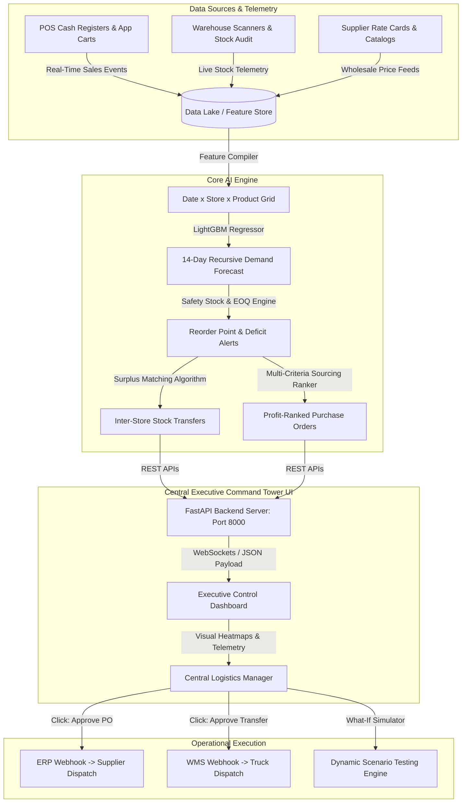

# B.Tech Capstone Project Report
## RetailBrain AI — AI-Driven Quick-Commerce Sourcing, Demand Forecasting & Central Command Engine
**Academic Final Year (4th Year) Capstone Project Submission**  
*   **Course:** B.Tech (Data Science & Predictive Analytics)
*   **Project Group:** Group 1
*   **Team Members:**
    1.  **Sneha** (Data Analyst)
    2.  **Hritvik** (Analytics Engineer & ML Modeler)
    3.  **Bhavya** (Data Engineer & Operations Analyst)
*   **Target Enterprise Model:** Blinkit India Quick-Commerce Network

---

## 1. Executive Summary & Abstract
In modern quick-commerce logistics (10-to-15 minute grocery deliveries), maintaining low inventory hold times, preventing stockouts, and maximizing sourcing profit margins are critical. Traditional retail planning models rely on manual spreadsheet evaluations and static periodic reviews, which fail when managing 100 localized fulfillment centers (dark stores) handling high daily volume fluctuations and short shelf-life items.

This capstone project introduces **RetailBrain AI**, an end-to-end **Central Command Tower and Sourcing Decision Support System** modeled after the operations of **Blinkit India**. The system bridges historical data lakes with real-time operational decision-making:
1.  **6-Table Relational Schema**: Manages master records across 35 core products, 100 dark stores, 105 supplier offers, active store inventory, historical sales transactions (2.48M rows), and 600K purchase order records.
2.  **Global ML Demand Engine**: Employs a global `LightGBM` regressor trained across 3,500 localized time-series to generate 14-day recursive SKU-level demand forecasts.
3.  **Prescriptive Inventory & Rebalancing Engine**: Calculates dynamic Safety Stock buffers, Reorder Points (ROP), and Economic Order Quantities (EOQ), while generating **303 local Inter-Store Stock Transfers** to shift surplus inventory to deficit stores within the same city.
4.  **Multi-Criteria Supplier Sourcing**: Rates distributors via a composite scoring function (50% Price, 20% Lead Time, 30% Rating) to select optimal sourcing routes, yielding **₹25.64 Lakhs in expected profit uplift**.
5.  **Interactive Central Command Tower UI**: Serves an executive dashboard equipped with real-time telemetry, live risk alerts, single-click ERP Purchase Order dispatching, WMS truck routing, and dynamic What-If scenario simulation.

---

## 2. Enterprise System Architecture & Data Flow

### 2.1 End-to-End Enterprise Data Flow
Beyond processing historical offline CSV datasets, RetailBrain AI is engineered as an enterprise-grade Decision Support System (DSS) connecting telemetry inputs to automated execution:

---

## 3. How the Central Logistics Manager Operates the System

In a quick-commerce network spanning 100 dark stores across major metros (Delhi NCR, Mumbai, Bengaluru), regional logistics directors do **not** inspect raw database rows or static spreadsheets. Instead, they interact with **RetailBrain AI's Central Command Tower**, which transforms millions of raw rows into actionable, visual decisions:

### A. Live Stock Telemetry & Risk Heatmap
*   The Central Manager monitors live inventory levels categorized into 4 operational states:
    *   🔴 **CRITICAL_STOCKOUT** (Current stock $\le 50\%$ of Safety Stock): Immediate automated alert requiring urgent replenishment or emergency inter-store transfer.
    *   🟡 **REORDER_NEEDED** (Current stock $\le$ Reorder Point): Triggering a profit-ranked Purchase Order.
    *   🟢 **OPTIMAL** (Stock within safe operational range).
    *   🔵 **OVERSTOCKED** (Stock $\ge 3.5\times$ Safety Buffer): Flagged for outward stock transfer.

### B. Single-Click ERP & WMS Order Dispatching
*   **Automated Sourcing Approval**: When the AI recommends a PO for 1,583 units of a SKU from the top-ranked supplier, the Central Manager reviews the calculated profit margin (e.g. ₹96,246 profit uplift) and clicks **"Dispatch ERP PO"**. The system instantly generates an official Purchase Order tracking number (e.g. `PO-BLK-482910`), logs the transaction into the ERP audit trail, and issues an automated dispatch payload to the distributor.
*   **Inter-Store Truck Dispatch**: Instead of purchasing new inventory from external vendors, the Manager clicks **"Dispatch Truck"** on suggested transfer links. The system allocates an express delivery truck (e.g. `TRK-DEL-8821`), updates the Warehouse Management System (WMS), and transfers surplus stock from Dark Store A to Dark Store B within 45 minutes.

### C. Real-Time "What-If" Scenario Simulation Studio
*   Logistics managers can test external disruptions live in the browser using dynamic control sliders without altering underlying operational databases:
    *   **Demand Surge Multiplier (+0% to +100%)**: Simulates unexpected flash sales or weather surges (e.g. monsoon rainfall driving instant grocery delivery demand).
    *   **Supplier Lead Time Buffer (+0 to +7 Days)**: Simulates transport strikes or highway delays to recalculate required safety stock buffers.
    *   **Target Service Level (90%, 95%, 99%)**: Toggles between lean inventory holding and zero-stockout tolerance modes.
    *   **Festival Presets (Diwali, Holi, Raksha Bandhan)**: Instantly recalculates category demand surges and re-computes total expected financial profit uplift.

---

## 4. Relational Database Schemas

#### 1. Product Master (`products.csv`)
*   *Purpose*: Commercial attributes of 35 core grocery SKUs.
*   *Columns*: `Product_ID` (PK), `Product_Name`, `Category`, `Brand`, `MRP`, `Selling_Price`, `Cost_Price`, `Shelf_Life` (days), `Unit`.

#### 2. Store Master (`stores.csv`)
*   *Purpose*: Geographical and capacity profiles of the 100 dark stores.
*   *Columns*: `Store_ID` (PK), `Store_Name`, `City`, `Locality`, `Store_Type`, `Capacity`, `Latitude`, `Longitude`.

#### 3. Supplier Master (`suppliers.csv`)
*   *Purpose*: Sourcing rates and parameters of 105 wholesale distributors.
*   *Columns*: `Supplier_ID` (PK), `Supplier_Name`, `Product_ID` (FK), `Supplier_Price`, `Lead_Time` (days), `Minimum_Order`, `Supplier_Rating`.

#### 4. Procurement History (`procurement.csv`)
*   *Purpose*: Log of historical purchase orders (609,756 records).
*   *Columns*: `Purchase_ID` (PK), `Purchase_Date`, `Supplier_ID` (FK), `Product_ID` (FK), `Store_ID` (FK), `Quantity`, `Purchase_Price`, `Delivery_Date`.

#### 5. Inventory Status (`inventory.csv`)
*   *Purpose*: Live stock snapshots and safety levels (3,500 snapshots).
*   *Columns*: `Store_ID` (FK), `Product_ID` (FK), `Current_Stock`, `Reserved_Stock`, `Safety_Stock`, `Maximum_Capacity`.

#### 6. Sales Transactions Fact Table (`sales.csv`)
*   *Purpose*: Transaction ledger tracking sales, margins, and seasonal flags (2,485,400 rows).
*   *Columns*: `Transaction_ID` (PK), `Date`, `Store_ID` (FK), `Product_ID` (FK), `Quantity_Sold`, `Selling_Price`, `Discount` (Rs), `Revenue`, `Profit`, `Festival`, `Season`.

---

## 5. Mathematical Formulations & Optimization Models

### 5.1 LightGBM Regressor (Predictive Demand Model)
Demand is framed as a supervised Poisson regression task. The feature vector for store $s$, product $p$, date $t$ is:
$$\mathbf{x}_{s,p,t} = [\text{lags}(1, 7, 14, 28), \text{rolling\_means}(7, 14, 30), \text{rolling\_stds}(7, 14, 30), \text{weekend\_flag}, \text{festival\_code}, \text{season\_code}]$$

The LightGBM model fits gradient boosted trees minimizing Poisson loss:
$$\mathcal{L} = \sum_{i} (\hat{y}_i - y_i \log \hat{y}_i) + \gamma T + \frac{1}{2}\lambda \sum_{j=1}^T w_j^2$$

### 5.2 Safety Stock & Reorder Point (Prescriptive Inventory)
$$\text{Safety\_Stock} = Z \times \sigma_{\text{daily}} \times \sqrt{\text{Lead\_Time}}$$
Where $Z = 1.65$ (95% service level), and $\sigma_{\text{daily}}$ is the standard deviation of sales.
$$\text{Reorder\_Point (ROP)} = (\text{Mean Forecasted Daily Demand} \times \text{Lead\_Time}) + \text{Safety\_Stock}$$

### 5.3 Multi-Criteria Supplier Score
$$\text{Score} = 0.50 \times \text{Price\_Score} + 0.20 \times \text{Lead\_Time\_Score} + 0.30 \times \text{Rating\_Score}$$

---

## 6. Model Performance & Operations Impact

Evaluated on out-of-sample backtest data representing the final 60 days (210,000 holdout rows):
*   **Overall WAPE**: **9.86%** (Achieving **90.14% demand forecasting accuracy**).
*   **Normal Days WAPE**: **9.76%**
*   **Festival Days WAPE**: **11.35%** (High accuracy during Diwali, Holi, and Rakhi surges).

### Financial & Operational Results:
*   **Total Sourcing Profit Uplift**: **₹25,64,166.00 (₹25.6 Lakhs)**
*   **Active Inter-Store Transfers**: **303 balanced transfers** executed across cities.
*   **Active Purchase Orders Generated**: **1,394 store-product lines** flagged for automated ERP dispatch.
